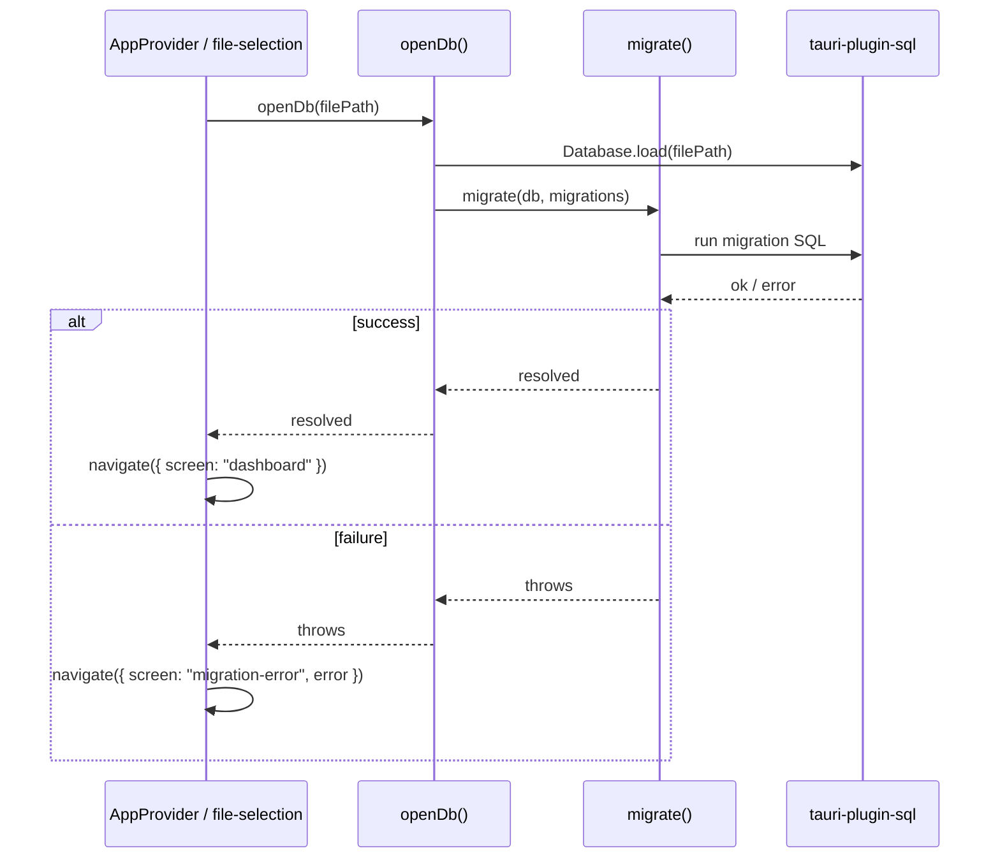

## ADDED Requirements

### Requirement: [F-00] Drizzle migrations run automatically on file open
The app SHALL execute all pending Drizzle migrations immediately after a data file is successfully opened, before routing the user to the dashboard. Migrations MUST run whether the file is opened via the welcome screen dialog or restored from `localStorage` on startup.

#### Scenario: Migrations apply successfully on startup
- **WHEN** the app starts and finds a stored file path in `localStorage`
- **AND** the file exists on disk
- **THEN** Drizzle migrations are executed against the file
- **AND** the user is routed to the dashboard

#### Scenario: Migrations apply successfully on explicit open
- **WHEN** the user selects an existing `.pfdata` file via the open dialog
- **THEN** Drizzle migrations are executed against the selected file
- **AND** the user is routed to the dashboard

#### Scenario: Migration failure on startup
- **WHEN** the app starts and opens a stored file
- **AND** a Drizzle migration throws an error
- **THEN** the user is NOT routed to the dashboard
- **AND** the app navigates to the migration-error screen
- **AND** the error message is displayed to the user

#### Scenario: Migration failure on explicit open
- **WHEN** the user opens a file via the dialog
- **AND** a Drizzle migration throws an error
- **THEN** the user is NOT routed to the dashboard
- **AND** the app navigates to the migration-error screen
- **AND** the error message is displayed to the user

#### Scenario: Migrations are idempotent on repeated open
- **WHEN** the app opens a file that already has all migrations applied
- **THEN** migrate() completes without error
- **AND** no duplicate schema changes are made
- **AND** the user is routed to the dashboard normally

### Requirement: [F-00] Migration error screen shown to user
The app SHALL display a dedicated migration-error screen when a migration fails. The screen MUST show the error message and provide a way for the user to return to the welcome screen.

#### Scenario: Migration error screen displays error details
- **WHEN** the app navigates to the migration-error screen
- **THEN** the error message from the failed migration is visible to the user

#### Scenario: User can return to welcome from migration error
- **WHEN** the user is on the migration-error screen
- **AND** the user activates the "Go back" or "Return to start" action
- **THEN** the app navigates to the welcome screen
