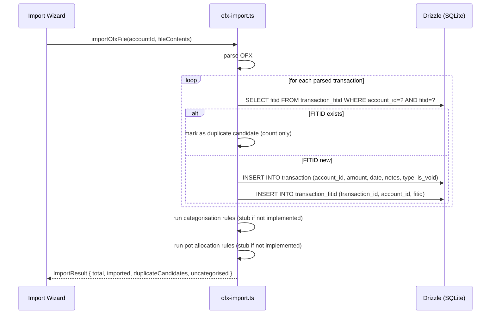

## ADDED Requirements

### Requirement: [F-07] `transaction_fitid` schema

The app SHALL store OFX Financial Institution Transaction IDs (FITIDs) in a dedicated `transaction_fitid` table. This table MUST NOT be merged into the `transaction` table to avoid sparse nulls on non-OFX rows.

```
transaction_fitid
  id              INTEGER  PK AUTOINCREMENT
  transaction_id  INTEGER  FK → transaction.id  NOT NULL
  account_id      INTEGER  FK → account.id      NOT NULL
  fitid           TEXT     NOT NULL

UNIQUE (account_id, fitid)
```

A Drizzle migration SHALL create this table. FITID uniqueness is scoped per account — the same FITID value on two different accounts is not a duplicate.

#### Scenario: Migration creates transaction_fitid table
- **WHEN** the app opens a database file that does not yet have the `transaction_fitid` table
- **THEN** the migration creates the table with the correct schema and no errors

#### Scenario: Duplicate FITID within same account is rejected at DB level
- **GIVEN** a `transaction_fitid` row exists for `(account_id=1, fitid="TX001")`
- **WHEN** another insert attempts `(account_id=1, fitid="TX001")`
- **THEN** the insert fails with a unique constraint violation

#### Scenario: Same FITID on different accounts is permitted
- **GIVEN** a `transaction_fitid` row exists for `(account_id=1, fitid="TX001")`
- **WHEN** a row is inserted for `(account_id=2, fitid="TX001")`
- **THEN** the insert succeeds without error

---

### Requirement: [F-07] OFX/QFX file parsing

The app SHALL parse OFX and QFX files in the frontend (TypeScript) using a library-based parser. The following fields SHALL be extracted per transaction: FITID, date (DTPOSTED), amount (TRNAMT), payee/memo (NAME or MEMO), transaction type (TRNTYPE). The closing ledger balance (LEDGERBAL / BALAMT) and its date SHALL be extracted at the statement level if present.

QFX files SHALL be treated identically to OFX files; no format distinction is needed.

The parser SHALL reject files that are structurally invalid (e.g., missing `<OFX>` or `<STMTTRN>` sections) with a user-visible error.

#### Scenario: Valid OFX file is parsed to a list of transactions
- **GIVEN** a valid `.ofx` file containing 10 `<STMTTRN>` blocks
- **WHEN** the file is parsed
- **THEN** 10 transaction objects are returned, each with FITID, date, amount, and memo populated

#### Scenario: Valid QFX file is parsed identically to OFX
- **GIVEN** a valid `.qfx` file
- **WHEN** the file is parsed
- **THEN** the parser returns the same structure as it would for an equivalent OFX file

#### Scenario: OFX file with closing balance is parsed correctly
- **GIVEN** a valid OFX file with a `<LEDGERBAL>` block containing `<BALAMT>1234.56` and `<DTASOF>20240131`
- **WHEN** the file is parsed
- **THEN** the statement-level object contains `closingBalance = 1234.56` and `closingBalanceDate = "2024-01-31"`

#### Scenario: OFX file without closing balance parses without error
- **GIVEN** a valid OFX file with no `<LEDGERBAL>` block
- **WHEN** the file is parsed
- **THEN** the statement-level object contains `closingBalance = null`

#### Scenario: Structurally invalid file produces a user-visible error
- **GIVEN** a file with `.ofx` extension that does not contain valid OFX markup
- **WHEN** the file is parsed
- **THEN** a descriptive error message is returned and no transactions are processed

---

### Requirement: [F-07] OFX transaction import with FITID-based duplicate detection

The app SHALL import all non-duplicate OFX transactions into the `transaction` table and record each FITID in `transaction_fitid`. Duplicate detection SHALL use `(account_id, fitid)` as the match key. Any transaction whose FITID already exists for the target account SHALL be flagged as a duplicate candidate (`is_pending = 1`) and SHALL NOT be inserted into the `transaction` table as a new row.

**Duplicates are never auto-skipped or auto-imported — they are always held as `is_pending = 1` for user review.**

The import SHALL run inside a single DB transaction. All inserts either commit together or roll back together.

Amount convention: positive TRNAMT = credit (positive real); negative TRNAMT = debit (negative real). No sign inversion is applied.

Imported transactions SHALL have `type = "import"` and `is_void = 0`.



#### Scenario: New transactions are imported and FITIDs recorded
- **GIVEN** an OFX file with 5 transactions, none of whose FITIDs exist in the database for the target account
- **WHEN** the import runs
- **THEN** 5 rows are inserted into `transaction`
- **AND** 5 rows are inserted into `transaction_fitid`
- **AND** the result shows imported = 5, duplicate candidates = 0

#### Scenario: Duplicate FITIDs are flagged and not imported
- **GIVEN** an OFX file with 3 transactions
- **AND** 1 of those FITIDs already exists in `transaction_fitid` for the same account
- **WHEN** the import runs
- **THEN** 2 rows are inserted into `transaction`
- **AND** 1 transaction is counted as a duplicate candidate
- **AND** the duplicate candidate is NOT inserted into `transaction`
- **AND** the result shows imported = 2, duplicate candidates = 1

#### Scenario: Duplicate transaction is held for user review, not silently skipped
- **GIVEN** a FITID that already exists for the target account
- **WHEN** the import encounters this FITID
- **THEN** the transaction is recorded as a duplicate candidate in the import result
- **AND** no automatic action is taken — the transaction awaits user review

#### Scenario: Import rolls back on error
- **GIVEN** an OFX file where insertion of the 4th transaction fails (e.g., constraint violation)
- **WHEN** the import runs inside a DB transaction
- **THEN** no rows from this import are committed to `transaction` or `transaction_fitid`

#### Scenario: FITID from a different account is not treated as a duplicate
- **GIVEN** a FITID exists in `transaction_fitid` for account A
- **WHEN** importing an OFX file into account B with the same FITID value
- **THEN** the transaction is imported as new (not a duplicate candidate)

---

### Requirement: [F-07] Closing balance validation blocks import on mismatch

If the parsed OFX file contains a closing balance (`LEDGERBAL / BALAMT`), the app SHALL validate it against the account's calculated running balance after all non-duplicate transactions have been inserted. If the values differ by more than £0.005 (rounding tolerance), the entire import SHALL be rolled back and the user SHALL see an error message explaining the mismatch.

If no closing balance is present in the OFX file, this validation is skipped and the import proceeds normally.

#### Scenario: Import succeeds when closing balance matches
- **GIVEN** an OFX file with a `LEDGERBAL` of 5000.00
- **AND** the account's running balance after inserting the imported transactions equals 5000.00
- **WHEN** the import runs
- **THEN** the import is committed and the result screen is shown

#### Scenario: Import is blocked when closing balance does not match
- **GIVEN** an OFX file with a `LEDGERBAL` of 5000.00
- **AND** the account's running balance after inserting the imported transactions equals 4950.00
- **WHEN** the import runs
- **THEN** the entire import is rolled back (no rows are persisted)
- **AND** the user sees an error: "Import blocked: closing balance in file (5000.00) does not match calculated balance (4950.00). The file may be incomplete."

#### Scenario: Import proceeds normally when no closing balance is in the file
- **GIVEN** an OFX file with no `<LEDGERBAL>` block
- **WHEN** the import runs
- **THEN** no balance validation is performed
- **AND** the import is committed normally

---

### Requirement: [F-07] Categorisation and pot allocation rules run on imported OFX transactions

The import pipeline SHALL invoke the categorisation rules engine and the pot allocation rules engine on each imported transaction. If either engine is not yet implemented, a no-op stub SHALL be called so the import result can correctly report the uncategorised count. The uncategorised count SHALL equal the number of imported transactions that have no category assigned after the rules engine runs.

#### Scenario: Uncategorised count reflects transactions with no category match
- **GIVEN** an OFX file with 10 transactions
- **AND** categorisation rules match 6 of them
- **WHEN** the import runs
- **THEN** the result screen shows uncategorised = 4

#### Scenario: All transactions categorised yields zero uncategorised count
- **GIVEN** an OFX file where all transactions match a categorisation rule
- **WHEN** the import runs
- **THEN** the result screen shows uncategorised = 0

#### Scenario: Import result shows zero uncategorised when rules engine is not yet implemented (stub)
- **GIVEN** the categorisation rules engine has not been implemented (stub returns no matches)
- **WHEN** an OFX file with 5 transactions is imported
- **THEN** the result screen shows uncategorised = 5 (all transactions lack a category)
