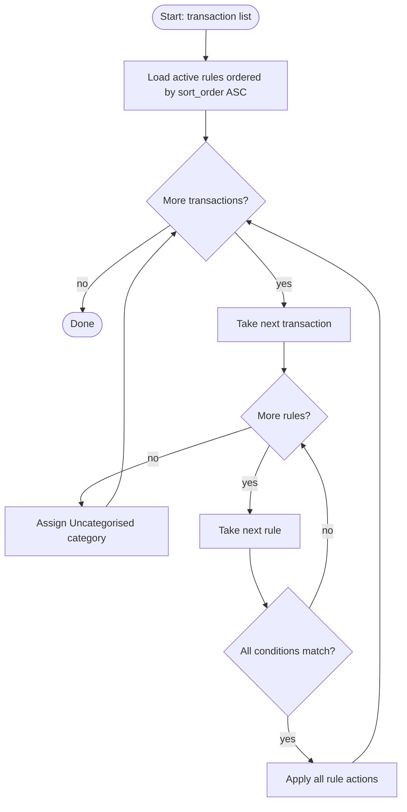

## ADDED Requirements

### Requirement: [F-10] Categorisation rules engine evaluates rules in priority order

The app SHALL maintain a set of categorisation rules stored in the `categorisation_rule` table. The rules engine SHALL evaluate each rule in ascending `sort_order` order. For each transaction, the first rule whose ALL conditions match SHALL be applied — no further rules are evaluated for that transaction (first-match-wins). Transactions that match no active rule SHALL be assigned the `Uncategorised` category. Only rules with `is_active = 1` are evaluated.

#### Scenario: First matching rule wins, subsequent rules are skipped
- **GIVEN** two active rules where rule A (sort_order=1) matches a transaction and rule B (sort_order=2) also matches
- **WHEN** the engine processes the transaction
- **THEN** rule A's actions are applied
- **AND** rule B is not evaluated for that transaction

#### Scenario: Unmatched transaction gets Uncategorised category
- **GIVEN** a transaction that matches no active rule
- **WHEN** the engine processes the transaction
- **THEN** the transaction's `category_id` is set to the `Uncategorised` category's id

#### Scenario: Inactive rules are skipped
- **GIVEN** a rule with `is_active = 0` that would otherwise match a transaction
- **WHEN** the engine processes the transaction
- **THEN** the inactive rule is not evaluated
- **AND** the transaction proceeds to the next active rule

#### Scenario: Void transactions are not processed
- **GIVEN** a transaction with `is_void = 1`
- **WHEN** the engine runs
- **THEN** the void transaction is not modified

---

### Requirement: [F-10] Condition evaluation supports multiple fields and operators

Each rule condition SHALL match against a transaction field using a specified operator and value. Multiple conditions on the same rule are combined with AND logic — all conditions must match for the rule to apply.

Supported fields and their mapping to transaction columns:
- `description` → `notes` column
- `reference` → `reference` column
- `amount` → `amount` column (numeric comparison)
- `transaction_type` → `type` column
- `payee` → `payee` column
- `account` → `account_id` column (matched by account name)
- `category` → `category_id` column (matched by category name)

Supported operators:
- `contains` — field value contains the condition value (case-insensitive substring match)
- `starts_with` — field value starts with the condition value (case-insensitive)
- `equals` — field value equals the condition value (case-insensitive for text, exact for numeric)
- `greater_than` — numeric field value is strictly greater than the condition value (amount only)
- `less_than` — numeric field value is strictly less than the condition value (amount only)

#### Scenario: `contains` operator matches case-insensitively
- **GIVEN** a rule condition: field=`description`, operator=`contains`, value=`coffee`
- **WHEN** a transaction has notes=`Starbucks Coffee`
- **THEN** the condition matches

#### Scenario: `starts_with` operator matches prefix case-insensitively
- **GIVEN** a rule condition: field=`description`, operator=`starts_with`, value=`amazon`
- **WHEN** a transaction has notes=`Amazon Prime`
- **THEN** the condition matches

#### Scenario: `equals` operator requires exact match for text
- **GIVEN** a rule condition: field=`payee`, operator=`equals`, value=`TESCO`
- **WHEN** a transaction has payee=`tesco`
- **THEN** the condition matches (case-insensitive)

#### Scenario: `greater_than` operator compares amount numerically
- **GIVEN** a rule condition: field=`amount`, operator=`greater_than`, value=`-10`
- **WHEN** a transaction has amount=`-5.00`
- **THEN** the condition matches (-5 > -10)

#### Scenario: `less_than` operator compares amount numerically
- **GIVEN** a rule condition: field=`amount`, operator=`less_than`, value=`0`
- **WHEN** a transaction has amount=`-3.50`
- **THEN** the condition matches (-3.50 < 0)

#### Scenario: Multiple conditions require all to match
- **GIVEN** a rule with condition A: field=`payee`, operator=`contains`, value=`Starbucks`
- **AND** condition B: field=`amount`, operator=`less_than`, value=`0`
- **WHEN** a transaction has payee=`Starbucks` and amount=`5.00` (credit)
- **THEN** condition B does not match (5.00 is not less than 0)
- **AND** the rule does not apply

#### Scenario: Invalid numeric cast is treated as non-matching
- **GIVEN** a rule condition with operator=`greater_than` on an amount field
- **WHEN** the stored condition value cannot be parsed as a number
- **THEN** the condition is treated as non-matching
- **AND** no error is thrown

---

### Requirement: [F-10] Rule actions apply category assignment and note setting

When a rule matches a transaction, all of its actions SHALL be applied in order. Supported action types:
- `assign_category`: sets the transaction's `category_id` to the specified category
- `set_note`: overwrites the transaction's `notes` field with the specified text value

#### Scenario: `assign_category` action sets category_id
- **GIVEN** a matching rule with action: type=`assign_category`, category=`Groceries`
- **WHEN** the engine applies the rule to a transaction
- **THEN** the transaction's `category_id` is updated to the Groceries category's id

#### Scenario: `set_note` action overwrites existing notes
- **GIVEN** a transaction with notes=`OLD MEMO` and a matching rule with action: type=`set_note`, note=`Supermarket shop`
- **WHEN** the engine applies the rule
- **THEN** the transaction's `notes` is set to `Supermarket shop`
- **AND** the previous notes value is discarded

#### Scenario: Multiple actions on one rule are all applied
- **GIVEN** a rule with two actions: `assign_category` (Groceries) and `set_note` (Supermarket)
- **WHEN** the rule matches a transaction
- **THEN** both the category_id and notes are updated in the same operation

---

### Requirement: [F-10] Engine can be manually re-run against all existing transactions

The app SHALL provide a command to re-run the rules engine against all non-void transactions. This allows users to apply new or updated rules to historical data. The re-run SHALL overwrite existing category assignments on all affected transactions.

#### Scenario: Manual re-run applies rules to all non-void transactions
- **GIVEN** the user triggers a manual re-run
- **WHEN** the engine executes
- **THEN** all non-void transactions (regardless of existing category) are re-evaluated against all active rules
- **AND** the result (new category or Uncategorised) is written to each transaction

#### Scenario: Manual re-run completes and returns count of categorised transactions
- **GIVEN** the user triggers a manual re-run with 50 non-void transactions
- **WHEN** the engine finishes
- **THEN** the command returns the number of transactions that were assigned a category (excluding Uncategorised)

---

### Requirement: [F-10] Database schema for rules

The app SHALL store rules using three tables:

**`categorisation_rule`**: id (PK), name (text, not null), sort_order (integer, not null), is_active (integer, default 1)

**`rule_condition`**: id (PK), rule_id (FK → categorisation_rule.id), field (text, not null), operator (text, not null), value (text, not null)

**`rule_action`**: id (PK), rule_id (FK → categorisation_rule.id), action_type (text, not null — `assign_category` | `set_note`), category_id (integer nullable FK → category.id), note (text nullable)

A Drizzle migration SHALL create these three tables. `is_active` is stored as integer 0/1 following project conventions.

#### Scenario: Migration creates all three rule tables
- **WHEN** the database migration runs on a file that does not yet have the rules tables
- **THEN** `categorisation_rule`, `rule_condition`, and `rule_action` tables exist in the schema
- **AND** existing data is unaffected

#### Scenario: Rule with no conditions matches every transaction
- **GIVEN** a rule with `is_active = 1` and no conditions
- **WHEN** the engine evaluates any non-void transaction
- **THEN** the rule matches (vacuous truth — AND of empty set is true)
- **AND** its actions are applied
