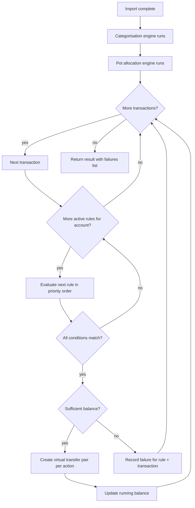

## ADDED Requirements

### Requirement: [F-12] Pot allocation rules engine evaluates rules after import

The system SHALL evaluate pot allocation rules immediately after each import completes and after the categorisation rules engine has run. The engine SHALL:
- Fetch all active rules for the imported account, ordered by `priority ASC`
- For each imported transaction (in import order), evaluate rules in priority order
- Apply first-match-wins: the first matching rule fires and no further rules are evaluated for that transaction
- Conditions use AND logic — all conditions in a rule must match for the rule to fire

Condition matching behaviour:
- `contains`: case-insensitive substring match on the target field
- `starts_with`: case-insensitive prefix match on the target field
- `equals`: case-insensitive equality for text fields; numeric equality for `amount`
- `greater_than` / `less_than`: numeric comparison on `amount` only
- If a condition value fails numeric casting for `greater_than`/`less_than`, the condition is treated as non-matching (no error)



#### Scenario: Engine evaluates rules in priority order and stops at first match
- **GIVEN** two active rules for an account: Rule A (priority 1, condition: description contains "SALARY") and Rule B (priority 2, condition: description contains "SAL")
- **WHEN** a transaction with description "SALARY" is imported
- **THEN** Rule A matches and fires
- **AND** Rule B is not evaluated for that transaction

#### Scenario: No rule fires when no conditions match
- **GIVEN** one active rule with condition: description contains "SALARY"
- **WHEN** a transaction with description "MORTGAGE" is imported
- **THEN** no rule fires and no virtual transfers are created for that transaction

#### Scenario: Inactive rules are skipped
- **GIVEN** a rule with `is_active = 0` that would otherwise match a transaction
- **WHEN** the transaction is imported
- **THEN** the rule is not evaluated and does not fire

#### Scenario: Rules scoped to other accounts do not fire
- **GIVEN** Account A has a rule with condition: description contains "SALARY"
- **WHEN** a transaction matching that condition is imported into Account B
- **THEN** Account A's rule does not fire

#### Scenario: All condition fields match correctly
- **GIVEN** a rule with condition field=`amount` operator=`greater_than` value=`1000`
- **WHEN** a transaction with amount=1500.00 is imported
- **THEN** the condition matches

#### Scenario: amount less_than condition matches correctly
- **GIVEN** a rule with condition field=`amount` operator=`less_than` value=`0`
- **WHEN** a transaction with amount=-50.00 is imported
- **THEN** the condition matches

---

### Requirement: [F-12] Engine creates virtual transfer pairs when a rule fires

When a pot allocation rule fires, the system SHALL create one virtual debit transaction on the main account and one virtual credit transaction per action (per target pot). Both sides SHALL be linked via `linked_transaction_id`. Running balances SHALL be recalculated for the main account and all affected pots after virtual transfers are inserted.

Virtual transaction values:
- Account debit: `amount = -(action.allocation_value)`, `account_id = <account>`, `pot_id = NULL`, `category_id = <savings-transfer category>`, `notes = "Auto-transfer to <pot name>"`
- Pot credit: `amount = +(action.allocation_value)`, `pot_id = <action.pot_id>`, `account_id = NULL`, `category_id = <savings-transfer category>`, `notes = "Auto-transfer to <pot name>"`

The "Savings transfer" category SHALL be auto-created on first use if it does not exist. Virtual transfer transactions SHALL NOT pass through the categorisation rules engine.

#### Scenario: Firing a single-action rule creates one debit and one credit
- **GIVEN** a rule with one action allocating £200 to "Holiday Pot"
- **WHEN** the rule fires on a transaction
- **THEN** one debit of -200.00 is created on the main account
- **AND** one credit of +200.00 is created on "Holiday Pot"
- **AND** both transactions share the same `linked_transaction_id`

#### Scenario: Firing a multi-action rule creates multiple transfer pairs
- **GIVEN** a rule with two actions: £200 to "Holiday Pot" and £100 to "Rainy Day Pot"
- **WHEN** the rule fires on a transaction
- **THEN** two debit transactions are created on the main account (−200 and −100)
- **AND** one credit is created on "Holiday Pot" (+200) and one on "Rainy Day Pot" (+100)
- **AND** each debit/credit pair shares a `linked_transaction_id`

#### Scenario: Virtual transfers are assigned the Savings transfer category
- **GIVEN** a rule fires and creates virtual transfer transactions
- **THEN** all virtual transfer transactions have `category_id` set to the "Savings transfer" category
- **AND** the categorisation rules engine does not process these transactions

#### Scenario: Running balance is recalculated after virtual transfers
- **GIVEN** an account with running balance 1000.00 before a rule fires
- **WHEN** a rule fires allocating £200 to a pot
- **THEN** the account's running balance reflects the debit (800.00)
- **AND** the pot's running balance reflects the credit (+200.00)

---

### Requirement: [F-12] Engine blocks a rule when the account has insufficient balance

Before creating any virtual transfers for a matched rule, the system SHALL sum all `allocation_value` fields across all actions in the rule. If the total exceeds the account's current running balance, the entire rule SHALL be blocked — no partial allocations are made. The transaction is imported as normal; only the pot allocations are skipped. A failure entry SHALL be recorded for surfacing on the import result screen.

#### Scenario: Rule blocked when total allocation exceeds account balance
- **GIVEN** a rule with two actions totalling £500 allocation
- **AND** the account's current running balance is £300
- **WHEN** a transaction matches the rule
- **THEN** no virtual transfers are created for any action in the rule
- **AND** a failure is recorded: rule name + list of pot names that could not be allocated to

#### Scenario: Rule fires successfully when balance is exactly sufficient
- **GIVEN** a rule with total allocation of £300
- **AND** the account's current running balance is £300
- **WHEN** a transaction matches the rule
- **THEN** all virtual transfers are created normally

#### Scenario: Earlier transfers in the same import batch reduce available balance for later rules
- **GIVEN** an account with running balance £400
- **AND** Rule A (priority 1) allocates £300 and fires first on Transaction 1
- **AND** Rule B (priority 1) allocates £200 and would fire on Transaction 2
- **WHEN** Transaction 1 and Transaction 2 are both imported in the same batch
- **THEN** Rule A fires (balance sufficient: 400 ≥ 300)
- **AND** after Rule A fires the balance is £100
- **AND** Rule B is blocked on Transaction 2 (balance insufficient: 100 < 200)

---

### Requirement: [F-12] Import result screen surfaces pot allocation failures

The import result screen SHALL display a section listing any pot allocation rule failures that occurred during the import. Each failure entry SHALL show the rule name and the pot(s) that could not be allocated to. If no failures occurred, the section SHALL not be shown.

```
┌─────────────────────────────────────────┐
│  Import Complete                        │
├─────────────────────────────────────────┤
│  ✓ Import finished                      │
│                                         │
│  Total rows          42                 │
│  Imported            39                 │
│  Duplicate candidates  2                │
│  Categorised          34                │
│  Uncategorised         5                │
│  Pot allocations        3               │
│                                         │
│  ⚠ Allocation failures                  │
│  Rule 'Salary split' — insufficient     │
│  balance for Holiday pot                │
│                                         │
│                               [Done]   │
└─────────────────────────────────────────┘
```

shadcn/ui components: `Card` or summary list, `Alert`, `Button`.

#### Scenario: Result screen shows allocation failure details
- **GIVEN** a rule named "Salary split" was blocked due to insufficient balance for "Holiday pot"
- **WHEN** the import result screen is shown
- **THEN** a failure entry is displayed: "Rule 'Salary split' — insufficient balance for Holiday pot"

#### Scenario: Result screen shows count of successful pot allocations
- **GIVEN** 3 virtual transfer pairs were created during import
- **WHEN** the import result screen is shown
- **THEN** "Pot allocations: 3" is shown in the summary counts

#### Scenario: No failure section shown when all rules fire successfully
- **GIVEN** all pot allocation rules that fired completed without balance failures
- **WHEN** the import result screen is shown
- **THEN** no allocation failures section is displayed
