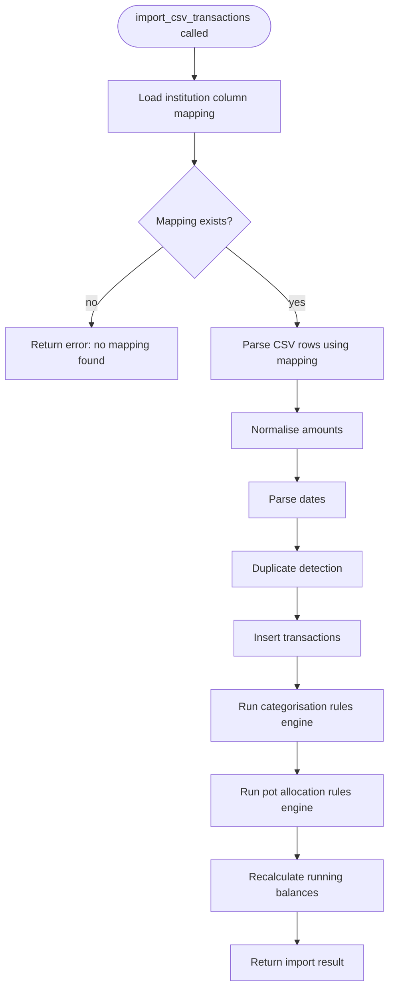

## ADDED Requirements

### Requirement: [F-07] transaction schema — is_duplicate_candidate flag

The `transaction` table SHALL have an `is_duplicate_candidate INTEGER NOT NULL DEFAULT 0` column (boolean, 0/1). Transactions flagged as duplicate candidates SHALL NOT appear in the main transaction list. A Drizzle migration SHALL add this column to the existing table.

#### Scenario: Migration adds is_duplicate_candidate column
- **GIVEN** the app opens a database whose `transaction` table does not yet have `is_duplicate_candidate`
- **WHEN** the migration runner executes
- **THEN** the column is added with `NOT NULL DEFAULT 0` and no errors

#### Scenario: Existing transactions default to is_duplicate_candidate = 0
- **GIVEN** a migration adds `is_duplicate_candidate` to an existing database with 50 transactions
- **WHEN** the migration completes
- **THEN** all 50 existing transaction rows have `is_duplicate_candidate = 0`

---

### Requirement: [F-07] CSV import handler — parse and normalise transactions

The app SHALL provide an `import_csv_transactions` Tauri command that accepts an account ID and the CSV file contents as a string. The command SHALL:
1. Load the saved `institution_column_mapping` for the account's institution
2. Use the mapping to extract per-row values for date, payee, notes, amount/debit/credit, balance, and reference
3. Normalise amounts: `single` convention stores the value as-is (signed real); `split` convention computes `amount = credit - debit`
4. Parse dates to ISO `YYYY-MM-DD` using the saved date format
5. Skip the header row when `hasHeaderRow` is true
6. Return a structured result: `{ imported, duplicateCandidates, parseErrors }`



#### Scenario: CSV rows are imported with correct field mapping
- **GIVEN** an institution mapping with date=0, payee=1, amount=2, amountConvention='single', dateFormat='dd/MM/yyyy', hasHeaderRow=true
- **AND** a CSV with header row followed by a row: "15/03/2024,TESCO STORES,-12.50"
- **WHEN** `import_csv_transactions` is called
- **THEN** one transaction is imported with date='2024-03-15', payee='TESCO STORES', amount=-12.50

#### Scenario: Split amount convention is normalised correctly
- **GIVEN** a mapping with amountConvention='split', debit=2, credit=3
- **AND** a CSV row with debit=12.50, credit=0 (credit cell is empty or zero)
- **WHEN** the import command processes this row
- **THEN** the transaction is stored with amount = -12.50 (0 - 12.50)

#### Scenario: Split convention credit-only row produces positive amount
- **GIVEN** a mapping with amountConvention='split', debit=2, credit=3
- **AND** a CSV row with debit=0, credit=2500.00
- **WHEN** the import command processes this row
- **THEN** the transaction is stored with amount = 2500.00 (2500.00 - 0)

#### Scenario: Header row is skipped when hasHeaderRow is true
- **GIVEN** a mapping with hasHeaderRow=true
- **AND** a CSV with 1 header row and 3 data rows
- **WHEN** the import command processes the file
- **THEN** exactly 3 transactions are created (header row not imported)

#### Scenario: Command returns error when no mapping exists for institution
- **GIVEN** an account whose institution has no saved column mapping
- **WHEN** `import_csv_transactions` is called
- **THEN** the command returns an error indicating no mapping is configured
- **AND** no transactions are imported

#### Scenario: Rows with unparseable dates are counted as parse errors
- **GIVEN** a CSV row whose date cell cannot be parsed with the saved date format
- **WHEN** the import command processes that row
- **THEN** the row is skipped and counted in `parseErrors`
- **AND** the remaining valid rows are imported

---

### Requirement: [F-07] CSV import — duplicate detection

The import command SHALL flag a transaction as a duplicate candidate if, for the same account, an existing non-void, non-duplicate-candidate transaction already exists with the same `date` AND `amount` AND at least one of the following also matches (case-insensitive, whitespace-trimmed): `notes`, `payee`, or `reference`. NULL fields do not satisfy a match condition.

Duplicate candidates are inserted with `is_duplicate_candidate = 1`. They are held for manual review and are NOT visible in the main transaction list. They are never silently skipped or auto-imported.

#### Scenario: Transaction flagged as duplicate when date, amount, and notes all match
- **GIVEN** account 1 has a transaction: date='2024-03-15', amount=-12.50, notes='coffee', payee=NULL
- **WHEN** a CSV row imports: date='2024-03-15', amount=-12.50, notes='coffee'
- **THEN** the imported transaction is inserted with `is_duplicate_candidate = 1`

#### Scenario: Transaction flagged as duplicate when date, amount, and payee match
- **GIVEN** account 1 has a transaction: date='2024-03-15', amount=-12.50, payee='TESCO', notes=NULL
- **WHEN** a CSV row imports: date='2024-03-15', amount=-12.50, payee='tesco' (case-insensitive)
- **THEN** the imported transaction is inserted with `is_duplicate_candidate = 1`

#### Scenario: Transaction NOT flagged when date and amount match but no secondary field matches
- **GIVEN** account 1 has a transaction: date='2024-03-15', amount=-12.50, notes=NULL, payee=NULL, reference=NULL
- **WHEN** a CSV row imports: date='2024-03-15', amount=-12.50, notes=NULL, payee=NULL, reference=NULL
- **THEN** the imported transaction is inserted with `is_duplicate_candidate = 0`

#### Scenario: Transaction NOT flagged as duplicate when amount differs
- **GIVEN** account 1 has a transaction: date='2024-03-15', amount=-12.50, notes='coffee'
- **WHEN** a CSV row imports: date='2024-03-15', amount=-13.00, notes='coffee'
- **THEN** the imported transaction is inserted with `is_duplicate_candidate = 0`

#### Scenario: Duplicate candidates are not shown in the main transaction list
- **GIVEN** an imported transaction has `is_duplicate_candidate = 1`
- **WHEN** the transaction list for the account is fetched
- **THEN** the flagged transaction does not appear in the list

#### Scenario: Duplicate candidates are counted on the import result screen
- **GIVEN** a CSV import produced 2 duplicate candidates
- **WHEN** the import result screen is shown
- **THEN** the "Duplicate candidates" count shows 2

---

### Requirement: [F-07] CSV import — rules engines and running balance

After all CSV rows have been inserted, the import command SHALL:
1. Run the categorisation rules engine against the newly inserted (non-duplicate-candidate) transactions
2. Run the pot allocation rules engine against the newly inserted transactions
3. Recalculate running balances for all non-void, non-duplicate-candidate transactions on the account, ordered by date ascending then id ascending as a tiebreaker

This mirrors the behaviour of the existing OFX import flow.

#### Scenario: Categorisation rules are applied to imported CSV transactions
- **GIVEN** a categorisation rule exists matching payee "TESCO" to category "Groceries"
- **WHEN** a CSV import inserts a transaction with payee='TESCO STORES' (assuming rule uses contains logic)
- **AND** the transaction matches the rule
- **THEN** the transaction has its `category_id` set to the Groceries category

#### Scenario: Running balance is recalculated after CSV import
- **GIVEN** an account with existing transactions has a current running balance
- **WHEN** a CSV import inserts 3 new transactions dated earlier than the most recent existing transaction
- **THEN** the running balance is recalculated for all affected rows from the earliest new transaction date onward

#### Scenario: Duplicate candidate transactions are excluded from running balance calculation
- **GIVEN** a CSV import produced 1 imported transaction and 1 duplicate candidate
- **WHEN** running balances are recalculated
- **THEN** only the non-duplicate-candidate transaction is included in the balance chain

---

### Requirement: [F-07] Import result screen shows CSV-specific counts

The existing import result screen SHALL display counts from CSV imports using the same layout as OFX imports. The result SHALL include `parseErrors` as an additional count shown only when greater than zero.

```
┌─────────────────────────────────────────┐
│  Import Complete                        │
├─────────────────────────────────────────┤
│                                         │
│  ✓ Import finished                      │
│                                         │
│  Total rows           42                │
│  Imported             39                │
│  Duplicate candidates  2                │
│  Categorised          34                │
│  Uncategorised         5                │
│  Pot allocations        3               │
│  Parse errors           1               │  ← only shown if > 0
│                                         │
│                               [Done]   │
└─────────────────────────────────────────┘
```

#### Scenario: Import result screen shows parse errors count when rows failed
- **GIVEN** a CSV import completed with 1 row that could not be parsed
- **WHEN** the import result screen is shown
- **THEN** "Parse errors: 1" is visible on the result screen

#### Scenario: Import result screen does not show parse errors when count is zero
- **GIVEN** a CSV import completed with no parse errors
- **WHEN** the import result screen is shown
- **THEN** no "Parse errors" row is displayed
