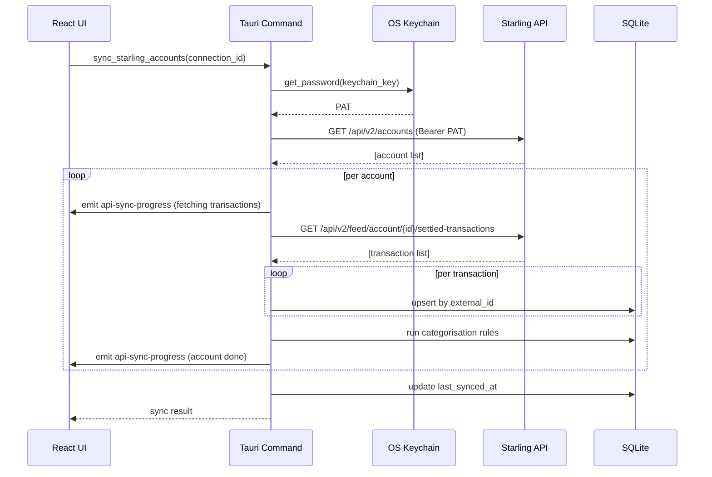

### Requirement: [F-API-11] sync_starling_accounts Tauri command

The system SHALL provide a `sync_starling_accounts` Tauri command that accepts an `institution_api_connection_id` and performs the following steps:
1. Retrieve the PAT from the OS keychain using `keychain_key`
2. Call the Starling AISP API to fetch all accounts for the connection
3. For each account, fetch transactions from `last_synced_at` (or 1 year ago for initial sync)
4. For each transaction: if `external_id` already exists for the account, overwrite local data if different; otherwise insert as new
5. Run the categorisation rules engine against newly inserted/updated transactions
6. Update `institution_api_connection.last_synced_at` to the current datetime
7. Emit `api-sync-progress` events to the frontend throughout the process

#### Scenario: Initial sync fetches 1 year of history
- **WHEN** `sync_starling_accounts` is called for a connection where `last_synced_at` is NULL
- **THEN** transactions are fetched from `now - 365 days` to now

#### Scenario: Subsequent sync fetches from last_synced_at
- **WHEN** `sync_starling_accounts` is called for a connection with a non-null `last_synced_at`
- **THEN** transactions are fetched from `last_synced_at` to now

#### Scenario: New transactions are inserted
- **WHEN** the API returns a transaction whose `external_id` does not exist in the local database
- **THEN** a new transaction row is created with `transaction_type = 'api_sync'` and `external_id` set

#### Scenario: Changed transactions are overwritten (source of truth)
- **WHEN** the API returns a transaction whose `external_id` already exists locally but with different field values
- **THEN** the local row is updated to match the API data (Starling wins)
- **AND** user-defined fields (notes, category, tags) are preserved

#### Scenario: Unchanged transactions are skipped
- **WHEN** the API returns a transaction whose `external_id` exists locally and all fields match
- **THEN** the local row is not modified

#### Scenario: Categorisation rules run on new transactions
- **WHEN** new transactions are inserted during sync
- **THEN** the categorisation rules engine runs against them automatically

#### Scenario: last_synced_at is updated on success
- **WHEN** sync completes without error
- **THEN** `institution_api_connection.last_synced_at` is set to the current ISO datetime

#### Scenario: Sync progress events are emitted
- **WHEN** sync is in progress
- **THEN** `api-sync-progress` events are emitted with account name and transaction count so far

---

### Requirement: [F-API-12] Startup sync triggers automatically

The system SHALL trigger `sync_starling_accounts` for every connected institution automatically when the app starts.

#### Scenario: All connected institutions sync in parallel on startup
- **WHEN** the app starts and there are connected institutions
- **THEN** sync is initiated for all connections in parallel
- **AND** progress indicators are shown in the UI for each sync in progress

#### Scenario: Startup sync failure does not prevent app launch
- **WHEN** a startup sync fails (e.g. network error, revoked PAT)
- **THEN** the app continues to operate normally using the last synced data
- **AND** an error notification identifies the failed institution

---

### Requirement: [F-API-13] Manual re-sync from Settings

The system SHALL allow the user to manually trigger a sync for a connected institution from the API Connections settings section.

#### Scenario: Re-sync button triggers sync
- **WHEN** the user clicks "Re-sync" for a connected institution
- **THEN** `sync_starling_accounts` is called for that connection
- **AND** a progress indicator is shown during the sync

#### Scenario: Re-sync button is disabled while sync is in progress
- **WHEN** a sync is already in progress for an institution
- **THEN** the Re-sync button for that institution is disabled

---

### Requirement: [F-API-14] Sync error handling

The system SHALL surface sync errors to the user clearly without crashing the app.

#### Scenario: Revoked PAT error is surfaced
- **WHEN** the Starling API returns a 401 Unauthorized response
- **THEN** an error notification states that the PAT may be expired or revoked
- **AND** the error is visible in the API Connections settings view

#### Scenario: Network unavailability is surfaced
- **WHEN** the Starling API is unreachable
- **THEN** an error notification states that the sync failed and shows the last successful sync time
- **AND** the app continues to operate normally using existing data

---

### Requirement: [F-API-15] Starling account mapper

The system SHALL translate Starling's account and transaction API response shapes into MyMoney's internal models.

Starling account → MyMoney account mapping:
- `name` → `account.name` (read-only)
- `currency` → `account.currency` (read-only)
- `accountType` → `account.account_type_id` (mapped via seed data)

Starling transaction → MyMoney transaction mapping:
- `feedItemUid` → `transaction.external_id`
- `transactionTime` → `transaction.date` (ISO date)
- `amount.minorUnits / 100` → `transaction.amount` (signed: CREDIT positive, DEBIT negative)
- `reference` → `transaction.description`

#### Scenario: Credit transaction maps to positive amount
- **WHEN** a Starling transaction has `direction = 'IN'` and `amount.minorUnits = 5000`
- **THEN** the local transaction has `amount = 50.00`

#### Scenario: Debit transaction maps to negative amount
- **WHEN** a Starling transaction has `direction = 'OUT'` and `amount.minorUnits = 1250`
- **THEN** the local transaction has `amount = -12.50`

#### Scenario: Unknown account type falls back to a default
- **WHEN** Starling returns an `accountType` value not present in MyMoney's seed data
- **THEN** a default account type is used and a warning is logged (sync is not aborted)

---

### Requirement: [F-API-16] Unit tests for sync command

The `sync_starling_accounts` Tauri command SHALL have Rust unit tests covering the sync logic with a mock HTTP layer.

#### Scenario: Sync command is unit-tested with mock HTTP responses
- **WHEN** tests are run
- **THEN** tests exist that feed fixture JSON responses and assert correct DB writes

#### Scenario: Overwrite logic is unit-tested
- **WHEN** tests are run
- **THEN** a test verifies that an existing transaction with matching external_id is overwritten when data differs

#### Scenario: User-defined fields are preserved on overwrite
- **WHEN** tests are run
- **THEN** a test verifies that notes and category are not overwritten during a sync update

#### Scenario: E2E test covers sync flow
- **WHEN** e2e tests are run
- **THEN** a Playwright test triggers a manual sync with a mock Starling server and verifies transactions appear in the transaction list
