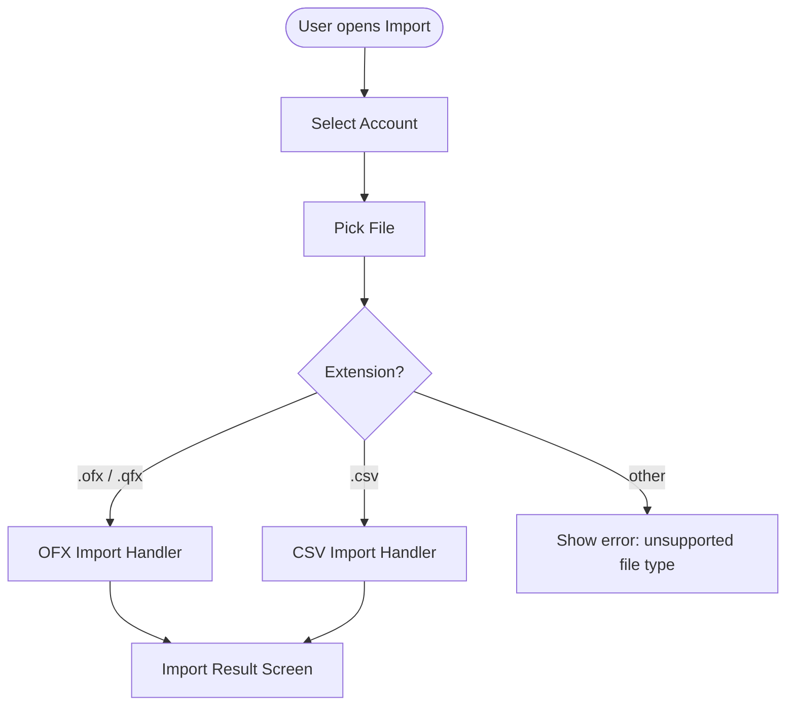

## ADDED Requirements

### Requirement: [F-07] Import entry point — account selection and file routing

The app SHALL provide an import wizard as the shared entry point for all transaction file imports. The user SHALL select a target account, then pick a file. The app SHALL detect the file type by extension and route to the appropriate import handler (`.ofx` / `.qfx` → OFX import; `.csv` → CSV import). No institution selection or column mapping step is shown for OFX files.



**Required:** Account selection, file picker accepting `.ofx`, `.qfx`, `.csv`

```
┌─────────────────────────────────────────┐
│  Import Transactions                    │
├─────────────────────────────────────────┤
│  Account *                              │
│  [Select account ▼                    ] │
│                                         │
│  File *                                 │
│  [No file selected        ] [Browse...] │
│                                         │
│  Supported: .ofx, .qfx, .csv           │
│                                         │
│                          [Cancel] [Next]│
└─────────────────────────────────────────┘
```

shadcn/ui components: `Select` (account picker), `Button`, `Dialog` or routed screen.

#### Scenario: User selects account and OFX file, proceeds to OFX handler
- **GIVEN** the import screen is open
- **WHEN** the user selects a valid account and picks a `.ofx` file
- **AND** clicks Next
- **THEN** the OFX import handler is invoked with the selected account ID and file path

#### Scenario: User selects account and QFX file, proceeds to OFX handler
- **GIVEN** the import screen is open
- **WHEN** the user selects a valid account and picks a `.qfx` file
- **AND** clicks Next
- **THEN** the OFX import handler is invoked (QFX is treated identically to OFX)

#### Scenario: User selects account and CSV file, proceeds to CSV handler
- **GIVEN** the import screen is open
- **WHEN** the user selects a valid account and picks a `.csv` file
- **AND** clicks Next
- **THEN** the CSV import handler is invoked with the selected account ID and file path

#### Scenario: Unsupported file type shows error
- **GIVEN** the import screen is open
- **WHEN** the user picks a file with an extension that is not `.ofx`, `.qfx`, or `.csv`
- **THEN** an inline error is shown stating the file type is not supported
- **AND** the Next button remains disabled

#### Scenario: Cannot proceed without account selection
- **GIVEN** the import screen is open
- **WHEN** no account has been selected
- **THEN** the Next button is disabled

#### Scenario: Cannot proceed without file selection
- **GIVEN** an account has been selected
- **WHEN** no file has been picked
- **THEN** the Next button is disabled

---

### Requirement: [F-07] Import result screen shows categorisation and allocation summary

The import result screen SHALL display counts for: total rows, imported, duplicate candidates, categorised, uncategorised, and pot allocations. It SHALL also display an allocation failures section when one or more pot allocation rules were blocked due to insufficient balance. Each failure entry SHALL include the rule name and the pot(s) that could not be allocated to. If no failures occurred, the allocation failures section SHALL not be shown.

```
┌─────────────────────────────────────────┐
│  Import Complete                        │
├─────────────────────────────────────────┤
│                                         │
│  ✓ Import finished                      │
│                                         │
│  Total rows          42                 │
│  Imported            39                 │
│  Duplicate candidates  2                │
│  Categorised          34                │
│  Uncategorised         5                │
│  Pot allocations        3               │
│                                         │
│  ⚠ Allocation failures (1)              │
│  Rule 'Salary split' — insufficient     │
│  balance for Holiday pot                │
│                                         │
│                               [Done]   │
└─────────────────────────────────────────┘
```

shadcn/ui components: `Card` or summary list, `Alert`, `Button`.

#### Scenario: Result screen shows correct counts after import with rules applied
- **GIVEN** an OFX file with 42 transactions has been imported
- **AND** 2 FITIDs matched existing records (duplicate candidates)
- **AND** the categorisation rules engine categorised 34 of the 39 imported transactions
- **AND** 5 imported transactions matched no active categorisation rule
- **AND** 3 pot allocation virtual transfer pairs were created
- **THEN** the result screen shows: total 42, imported 39, duplicate candidates 2, categorised 34, uncategorised 5, pot allocations 3

#### Scenario: Result screen shows zero duplicates when all transactions are new
- **GIVEN** an OFX file where no FITIDs exist in the database
- **WHEN** the import completes
- **THEN** the result screen shows duplicate candidates as 0

#### Scenario: Result screen shows all uncategorised when no categorisation rules exist
- **GIVEN** no active categorisation rules are defined
- **WHEN** an import completes with 10 transactions
- **THEN** the result screen shows categorised as 0 and uncategorised as 10

#### Scenario: Done button returns to dashboard
- **GIVEN** the result screen is visible
- **WHEN** the user clicks Done
- **THEN** the app navigates back to the dashboard

#### Scenario: Categorisation rules engine runs automatically after every import
- **GIVEN** at least one active categorisation rule exists
- **WHEN** any import (OFX or CSV) completes
- **THEN** the categorisation rules engine runs against the newly imported transactions before the result screen is shown
- **AND** transactions matching a rule have their category_id updated accordingly

#### Scenario: Pot allocation rules engine runs after categorisation engine
- **GIVEN** at least one active pot allocation rule exists for the imported account
- **WHEN** any import completes
- **THEN** the pot allocation rules engine runs against the newly imported transactions after the categorisation engine
- **AND** virtual transfer pairs are created for matching transactions

#### Scenario: Allocation failures are shown on the result screen
- **GIVEN** a rule named "Salary split" was blocked due to insufficient balance for "Holiday pot"
- **WHEN** the import result screen is shown
- **THEN** an allocation failures section is displayed listing "Rule 'Salary split' — insufficient balance for Holiday pot"

#### Scenario: No allocation failures section when no rules were blocked
- **GIVEN** all pot allocation rules that fired completed without balance failures
- **WHEN** the import result screen is shown
- **THEN** no allocation failures section is displayed

---

### Requirement: [F-07] OFX import — store transactions with extended schema

The OFX import command SHALL store imported transactions using the extended `transaction` schema. Each imported transaction SHALL have `type = 'imported'`. The `payee` column SHALL be populated from the OFX `<NAME>` field where present. The `notes` column SHALL be populated from the OFX `<MEMO>` field (existing behaviour). The `reference` column SHALL be populated from the OFX `<CHECKNUM>` field where present. The `running_balance` SHALL be recalculated for all affected account transactions after import completes (ordered by date ascending, id ascending as tiebreaker). `category_id` is left NULL on import (transactions start uncategorised).

The `description` column no longer exists on the `transaction` table; all bank description text maps to `notes`.

#### Scenario: OFX import populates payee from NAME field
- **GIVEN** an OFX file contains a transaction with `<NAME>Starbucks</NAME>`
- **WHEN** the user imports the file for an account
- **THEN** the imported transaction has `payee = 'Starbucks'`

#### Scenario: OFX import populates notes from MEMO field
- **GIVEN** an OFX file contains a transaction with `<MEMO>Coffee purchase</MEMO>`
- **WHEN** the user imports the file for an account
- **THEN** the imported transaction has `notes = 'Coffee purchase'`

#### Scenario: OFX import populates reference from CHECKNUM field
- **GIVEN** an OFX file contains a transaction with `<CHECKNUM>REF12345</CHECKNUM>`
- **WHEN** the user imports the file for an account
- **THEN** the imported transaction has `reference = 'REF12345'`

#### Scenario: Running balance is recalculated after OFX import
- **GIVEN** an account with existing transactions
- **WHEN** an OFX file is imported with new transactions
- **THEN** running balances for all transactions on or after the earliest imported date are recalculated

#### Scenario: OFX import with no NAME field leaves payee null
- **GIVEN** an OFX file contains a transaction with no `<NAME>` element
- **WHEN** the user imports the file
- **THEN** the imported transaction has `payee = NULL`
